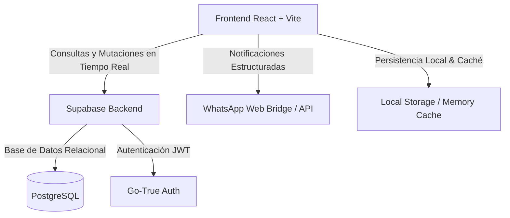
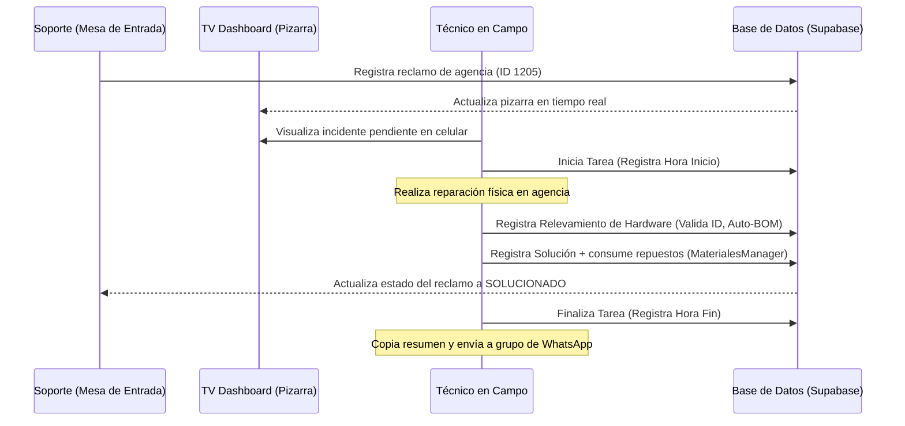

# SIG (Sistema Integrado de Gestión) - Hardware, Soporte y Relevamiento

Este documento detalla la documentación completa de la aplicación web **SIG (Sistema Integrado de Gestión)**, desarrollada para optimizar la logística, la auditoría de hardware y el soporte técnico del sector.

---

## 1. Introducción y Contexto del Sector

Históricamente, el sector de soporte técnico y control de hardware operaba bajo un modelo descentralizado y de comunicación informal. El canal exclusivo de asignación de tareas, relevamiento de equipamiento en agencias e informes de fallas era **WhatsApp**. 

La introducción de la plataforma **SIG**, acoplada a una base de datos relacional robusta en **Supabase (PostgreSQL)**, reemplaza de raíz este esquema obsoleto por una solución integral multidisciplinaria con control de inventario en tiempo real y trazabilidad transaccional completa.

---

## 2. El Escenario Previo: El Problema de WhatsApp y la Nula Trazabilidad

La dependencia de chats grupales de WhatsApp y planillas locales aisladas planteaba los siguientes inconvenientes críticos para el sector:

*   **Pérdida de Datos e Información Volátil**: Los mensajes de fallas reportadas quedaban sepultados en el historial del chat. No existía base de conocimiento ni registro indexable de soluciones.
*   **Trazabilidad Cero en Insumos**: Los materiales consumidos (discos, procesadores, fuentes, terminales) se retiraban de stock y se instalaban sin asociarse a un equipo específico ni a un ticket de soporte. Era imposible saber qué disco específico se instaló en qué CPU de qué agencia.
*   **Inventario Desactualizado**: El inventario de hardware de las agencias (puntos de venta) se relevaba esporádicamente en blocks de notas o mensajes de texto. No se conocía el parque informático real instalado en campo.
*   **Inexistencia de Métricas**: Al no registrarse las horas de inicio/fin de cada intervención, era imposible calcular el *Mean Time to Resolution* (MTTR), la frecuencia de fallas por marca/modelo, o auditar el rendimiento de las cuadrillas.
*   **Errores Operativos en Cascada**: La falta de validaciones permitía duplicar identificadores de agencias, ingresar caracteres inválidos, o registrar equipos sin sus dependencias físicas mínimas (BOM).

---

## 3. Beneficios Clave y Mejoras Aplicadas para el Sector

La digitalización del sector mediante la aplicación web SIG aporta las siguientes mejoras disruptivas:

### A. Trazabilidad Transaccional Total
Cada acción sobre el hardware genera un registro auditable en la base de datos:
*   **Auditoría de Cambios**: Registro automático de la fecha, el técnico que realiza la acción y el tipo de movimiento (`ALTA`, `BAJA`, `REUBICACIÓN`).
*   **Vínculo Incidente-Solución-Insumo**: Un reclamo pasa a estar vinculado a una solución técnica específica, la cual a su vez detalla los insumos exactos retirados del stock de materiales y sus números de serie correspondientes.

### B. Automatización de Dependencias (Motor Auto-BOM)
Para agilizar el relevamiento en campo, se diseñó un motor de **BOM (Bill of Materials)**:
*   Al registrar un equipo de categoría principal (por ejemplo, una Computadora All-in-One o una CPU), el sistema inserta automáticamente en la base de datos los componentes internos asociados (memoria RAM, almacenamiento, periféricos principales) según plantillas predefinidas en la tabla de insumos.
*   Esto reduce el tiempo de carga del técnico en un **75%** y estandariza los componentes esperados en cada terminal de venta.

### C. Rigor en Datos y Validaciones de Entrada
*   **Formatos Estrictos**: El identificador de agencias (ID) solo admite caracteres numéricos para evitar códigos inconsistentes en la base de datos.
*   **Flujo Secuencial en Relevamiento**: Los técnicos no pueden agregar un nuevo equipo al formulario de relevamiento hasta que el equipo anterior no se encuentre completamente completado (con su marca, producto, número de terminal, procesador o disco según corresponda).

### D. Centralización y Dashboards Operativos en Tiempo Real
*   **Pizarra de Soporte (TV Dashboard)**: Pantalla de visualización limpia diseñada para monitores/Smart TVs en centros de soporte técnico, que muestra en tiempo real los reclamos pendientes segmentados por prioridad y empresa.
*   **Métricas Ejecutivas**: Gráficos e indicadores en el panel de administrador sobre los equipos instalados, porcentaje de agencias con mantenimiento realizado e incidentes resueltos.

### E. Firma de Remito Digital y Reportes PDF
*   La aplicación genera un ticket de formato térmico (estilo remito) para impresión o almacenamiento digital directo en PDF que el técnico puede dejar en el punto de venta o adjuntar como comprobante oficial de la intervención de relevamiento.

---

## 4. Arquitectura y Stack Tecnológico

El sistema SIG está diseñado bajo un paradigma SPA (Single Page Application) moderno, eficiente y con alta tolerancia a fallos:

*   **Frontend**: React (v19) y Vite (v8) para un renderizado y hot-reloading ultra rápido.
*   **Estilos**: CSS nativo profesional (aprovechando variables CSS y clases adaptables para modo oscuro/claro y layouts responsivos). Iconografía integrada con **Lucide React**.
*   **Base de Datos**: Supabase (PostgreSQL) con esquemas relacionales estrictos y soporte nativo para JSONB (utilizado en el almacenamiento de especificaciones técnicas variables).
*   **Gestión del Estado de Conexión**: Monitorización activa de red con alertas en pantalla que bloquean operaciones críticas si el técnico pierde conectividad, evitando inconsistencias.

---

## 5. Módulos Detallados de la Aplicación

### 5.1. Control de Acceso y Gestión de Usuarios (`UsuariosManager`)
El acceso al sistema está restringido según cuatro perfiles definidos en la base de datos:
1.  **Administrador**: Acceso completo a auditorías, inventarios globales, gestión de usuarios y reasignaciones.
2.  **Encargado**: Gestión de stock de materiales, aprobación de bajas y visualización de mantenimientos.
3.  **Soporte**: Carga de reclamos técnicos y monitoreo del TV Dashboard.
4.  **Técnico**: Carga de relevamiento de agencias en campo y soluciones a tickets abiertos.

### 5.2. Panel Operativo de Administración (`PanelOperativo`)
Consola centralizada para los roles de administración que agrupa las siguientes pestañas:
*   **Inicio**: Métricas dinámicas, porcentajes de cumplimiento de mantenimientos y gráficos de soluciones mensuales.
*   **Reclamos/Tareas**: Gestión activa del ciclo de vida de los incidentes (Pendiente, En Taller, Solucionado).
*   **Inventario Físico (`InventarioPanel`)**: Buscador interactivo por agencia que despliega en una tabla con scroll vertical infinito e independiente y cabeceras fijas todo el hardware instalado en tiempo real. Permite realizar transferencias, bajas o asignaciones manuales de números de patrimonio.
*   **Materiales/Stock**: Control de depósitos de repuestos.
*   **Agencias (`AgenciasManager`)**: Registro maestro de puntos de venta geolocalizados, su estado de actividad y empresa asociada (Pálpitos, Alfa, TucuApuestas).
*   **Auditoría**: Visor de movimientos históricos de stock de equipos.

### 5.3. Formulario de Relevamiento (`RelevamientoForm`)
Interfaz optimizada para dispositivos móviles utilizada por los técnicos cuando visitan una agencia:
*   **Validación de Completitud**: Botón de "Agregar Equipo" inhabilitado dinámicamente si el hardware actual cargado en la fila no cuenta con los datos de marca, modelo, o nro de terminal correspondientes.
*   **Campos Dinámicos**: Muestra combos de procesadores y discos solo cuando la categoría del insumo lo requiere (ej: CPUs y AIOs).
*   **Remito Térmico Pre-Guardado**: Despliegue de un modal en formato de ticket impreso para verificar los datos antes de guardarlos. Admite cierre ágil mediante pulsación externa o tecla `Escape`.

### 5.4. Visor de Relevamiento Mensual (`RelevamientoViewer`)
*   **Reinicio de Estadísticas Visuales por Mes**: Las tarjetas de métricas superiores (AIO, CPU y Total Relevado) se recalculan dinámicamente según el mes seleccionado en la barra de herramientas, reseteando los totales mensualmente para auditorías de productividad sin alterar ni purgar los registros físicos de la base de datos.
*   **Filtros Avanzados**: Selector de periodos interactivo (muestra el mes actual por defecto y permite alternar a meses previos o al historial completo) y buscador en tiempo real por ID o nombre de agencia.

### 5.5. Carga de Soluciones Técnicas (`TaskForm`) y Consumo de Materiales (`MaterialesManager`)
*   **Registro de Intervención**: El técnico carga la solución al finalizar su trabajo, detallando horas e insumos utilizados.
*   **MaterialesManager**: Gestión del stock utilizado. Distingue entre equipos principales y componentes internos (hijos BOM):
    *   Si es un componente interno, en lugar de pedir Número de Serie (S/N), muestra la etiqueta de **"Nro de Terminal"** del equipo padre al que se asocia, garantizando consistencia semántica.
*   **Copiado para WhatsApp**: Genera un texto formateado resumido listo para copiar y pegar en los chats de WhatsApp con nomenclatura limpia (ej: `[Term: 2]` para componentes de la terminal 2), sirviendo de puente para la comunicación diaria rápida con la gerencia.

---

## 6. Flujo de Trabajo Estandarizado (Workflow)

---

## 7. Plan de Transición y Capacitación

Para asegurar la adopción exitosa y erradicar el uso informal de WhatsApp sin registro, se recomienda:
1.  **Fase 1: Carga Dual (1 semana)**: El personal continúa informando en WhatsApp pero soporte registra de forma obligatoria los tickets en la web SIG.
2.  **Fase 2: Monitoreo Activo (Semana 2)**: Los técnicos en campo comienzan a cargar relevamientos directamente desde su dispositivo móvil. El TV Dashboard es el único elemento visual de control en la oficina central.
3.  **Fase 3: Apagado de Informes Libres (Semana 3 en adelante)**: Solo se atienden y despachan incidentes que posean número de ticket en la plataforma SIG. WhatsApp queda relegado a notificaciones urgentes automáticas enviadas por la propia aplicación.
